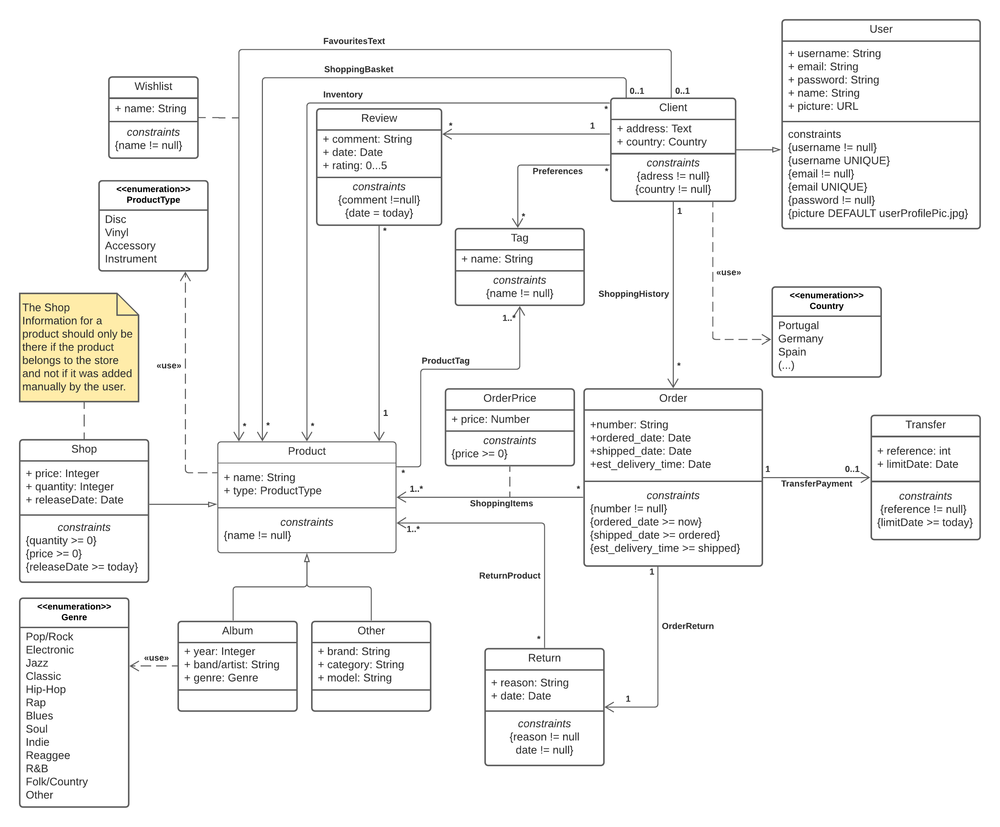

# EBD: Database Specification Component

An Online Shop where you can increase your musical collection, buying discs and instruments, in an easy, accessible, safe and customizable way.

## A4: Conceptual Data Model

The Conceptual Domain Model consists in the group of entities of the domain and the relationships between them using an UML class diagram to represent them.

The following section shows those entities, the relationships between them and the associated multiplicity and the attributes and its types. 

### 1. Class diagram


*Picture 1: UML Class Diagram*
### 2. Additional Business Rules
 
All the business rules and contraints needed to fulfill our Online Shop and its behaviour were added to the above UML class diagram.

---

## A5: Relational Schema, validation and schema refinement

This artifact contains the Relational Schema created by doing a mapping from the Conceptual Data Model described in the previous artifact, the Schema validation and the necessary SQL code to build the Database.

### 1. Relational Schema

Relation Schemas are specified in the compact notation:  

| Relation reference | Relation Compact Notation                        |
| ------------------ | ------------------------------------------------ |
| R01                | user(<ins>id</ins>, username __UK__ __NN__, email __UK__ __NN__, password __NN__, name __NN__, picture, is_admin __NN__) |
| R02                | client(<ins>user_id</ins> → user, address __NN__, country __NN__ __CK__ country IN Country)           |
| R03                | tag(<ins>name</ins>) |
| R04                | preferences(<ins>tag_id</ins> → tag, <ins>client_id</ins> → client) |
| R05                | productTag(<ins>tag_id</ins> → tag, <ins>product_id</ins> →  product) |
| R06                | order(<ins>id</ins>, number __NN__ __CK__ number > 0, ordered_date __NN__, shipped_date,  est_delivery_time __NN__, client_id → client __NN__) |
| R07                | review(<ins>id</ins>, comment __NN__,  date __NN__ __DF__ Now,  rating __NN__ __CK__ rating > 0 AND rating < = 5, client_id →  client) |
| R08                | product(<ins>id</ins>, name __NN__, type __CK__ type IN ProductType, description, picture) |
| R09                | product_review(<ins>product_id</ins> → product, <ins>review_id</ins> → review) |
| R10                | return(<ins>id</ins>, reason __NN__, date __NN__ __DF__ Now, prodcut_id → product __NN__, order_id → order __NN__) |
| R11                | shoppingBasket(<ins>id_client</ins> → client, <ins>id_product</ins> → product) |
| R12                | shoppingItems(<ins>id_order</ins> → order, <ins>id_product</ins> → product, price __NN__ __CK__ price > 0) |
| R13                | inventory(<ins>id_client</ins> → client, <ins>id_product</ins> → product) |
| R14                | wish_list(<ins>id_client</ins> → client, <ins>id_product</ins> → product) |
| R15                | transferPayment(<ins>id_order</ins> → order, <ins>transfer_id</ins> → transfer) |
| R16                | transfer(<ins>reference</ins>, limitDate __NN__ __DF__ Now) |
| R17                | shop(<ins>id</ins>, price __NN__ __CK__ price > 0, quantity __NN__ __CK__ quantity > 0, releaseDate __DF__ Now, product_id → product) |
| R18                | album(<ins>id</ins>, year, band_artist __NN__, genre __NN__ __CK__ genre IN Genre, product_id → product) |
| R19                | other(<ins>id</ins>, brand __NN__, category __NN__, model __NN__, product_id → product) |

__NN__ stands for __NOT NULL__, __UK__ for __UNIQUE__, __CK__ for __CHECK__ and __DF__ for __DEFAULT__

### 2. Domains

Specification of additional domains:  

| Domain Name | Domain Specification           |
| ----------- | ------------------------------ |
| Now	      | DATETIME DEFAULT CURRENT_DATETIME      |
| Country     | ENUM ('Portugal', 'Germany', 'Spain', ...) |
| ProductType   | ENUM ('Disc', 'Vinyl', 'Instrument', 'Accessory') |
| Genre       | ENUM ('Pop/Rock', 'Electronic', 'Jazz', 'Classic', 'Hip-Hop', 'Rap', 'Blues', 'Soul', 'Indie', 'Reaggee', 'R&B', 'Folk/Country', 'Other') |

### 3. Schema validation

In order to validate the Relational Schema of the previous section, the following tables present the functional dependencies. The conclusion of the normalization is at the end of this section.

| **TABLE R01**   | user               |
| --------------  | ---                |
| **Keys**        | {id}, {username}, {email}  |
| **Functional Dependencies:** |       |
| FD0101          | id → {username, email, password, name, picture, is_admin} |
| FD0102          | email → {id, username, password, name, picture, is_admin} |
| FD0103          | username → {id, email, password, name, picture, is_admin} |
| **NORMAL FORM** | BCNF               |

| **TABLE R02**   | client               |
| --------------  | ---                |
| **Keys**        | {user_id}  |
| **Functional Dependencies:** |       |
| FD0201          | user_id → {address, country} |
| **NORMAL FORM** | BCNF               |

| **TABLE R03**   | tag                |
| --------------  | ---                |
| **Keys**        | {name}             |
| **Functional Dependencies:**|        |
| none |                               |
| **NORMAL FORM** | BCNF               |

| **TABLE R04**   | preferences        |
| --------------  | ---                |
| **Keys**        | {tag_id}, {client_id} |
| **Functional Dependencies:** |       |
| none            |                    |
| **NORMAL FORM** | BCNF               |

| **TABLE R05**   | productTag        |
| --------------  | ---                |
| **Keys**        | {tag_id}, {product_id} |
| **Functional Dependencies:** |       |
| none            |                    |
| **NORMAL FORM** | BCNF               |

| **TABLE R06**   | order               |
| --------------  | ---                |
| **Keys**        | {id}  |
| **Functional Dependencies:** |       |
| FD0601          | id → {number, ordered_date, shipped_date,  est_delivery_time, client_id} |
| **NORMAL FORM** | BCNF               |

| **TABLE R07**   | review               |
| --------------  | ---                |
| **Keys**        | {id} |
| **Functional Dependencies:** |       |
| FD0701          | id → {comment, date, rating, client_id} |
| **NORMAL FORM** | BCNF               |

| **TABLE R08**   | product               |
| --------------  | ---                |
| **Keys**        | {id} |
| **Functional Dependencies:** |       |
| FD0801          | id → {name, type, description, picture, average} |
| **NORMAL FORM** | BCNF               |

| **TABLE R09**   | product_review               |
| --------------  | ---                |
| **Keys**        | {product_id}, {review_id} |
| **Functional Dependencies:** |       |
| none
| **NORMAL FORM** | BCNF               |

| **TABLE R10**   | return               |
| --------------  | ---                |
| **Keys**        | {id} |
| **Functional Dependencies:** |       |
| FD1001          | id → {reason, date, prodcut_id, order_id} |
| **NORMAL FORM** | BCNF               |

| **TABLE R11**   | shoppingBasket               |
| --------------  | ---                |
| **Keys**        | {id_client}, {id_product} |
| **Functional Dependencies:** |       |
| none            |                    |
| **NORMAL FORM** | BCNF               |

| **TABLE R12**   | shoppingItems               |
| --------------  | ---                |
| **Keys**        | {id_order}, {id_product} |
| **Functional Dependencies:** |       |
| FD1201          | id_order → {id_product, price} |
| FD1202          | id_product → {id_order, price} |
| **NORMAL FORM** | BCNF               |

| **TABLE R13**   | inventory               |
| --------------  | ---                |
| **Keys**        | {id_client}, {id_product} |
| **Functional Dependencies:** |       |
| none            |                    |
| **NORMAL FORM** | BCNF               |

| **TABLE R14**   | wishlist           |
| --------------  | ---                |
| **Keys**        | {id_client}, {id_product} |
| **Functional Dependencies:** |       |
| none            |                    |
| **NORMAL FORM** | BCNF               |

| **TABLE R15**   | transferPayment   |
| --------------  | ---                |
| **Keys**        | {id_order}, {tranfer_id}  |
| **Functional Dependencies:**        |
| (none)|
| **NORMAL FORM** | BCNF               |

| **TABLE R16**   | transfer          |
| --------------  | ---                |
| **Keys**        | {reference}  |
| **Functional Dependencies:** |       |
| FD1601          | reference → {limitDate} |
| **NORMAL FORM** | BCNF               |

| **TABLE R17**   | shop               |
| --------------  | ---                |
| **Keys**        | {id}  |
| **Functional Dependencies:** |       |**
| FD1701          | id → {price, quantity, releaseDate, product_id} |
| **NORMAL FORM** | BCNF               |

| **TABLE R18**   | album              |
| --------------  | ---                |
| **Keys**        | {id}  |
| **Functional Dependencies:** |       |
| FD1801          | id → {year, band_artist, genre, product_id} |
| **NORMAL FORM** | BCNF               |

| **TABLE R19**   | other              |
| --------------  | ---                |
| **Keys**        | {id}  |
| **Functional Dependencies:**|        |
| FD1901          | id → {brand, category, model, product_id} |
| **NORMAL FORM** | BCNF               |

All the relations are in the Boyce-Codd Normal Form (BCNF) so that proves that the Relation Schema is also in the BCNF, which means there's no need to do any change.

### 4. SQL Code

``` sql
/* TYPES */

CREATE TYPE country AS ENUM ('United States','Canada','Afghanistan','Albania','Algeria','American Samoa','Andorra','Angola','Anguilla','Antarctica','Antigua and/or Barbuda','Argentina','Armenia','Aruba','Australia','Austria','Azerbaijan','Bahamas','Bahrain','Bangladesh','Barbados','Belarus','Belgium', 'Belize', 'Benin', 'Bermuda', 'Bhutan', 'Bolivia', 'Bosnia and Herzegovina', 'Botswana', 'Bouvet Island', 'Brazil', 'British Indian Ocean Territory', 'Brunei Darussalam', 'Bulgaria', 'Burkina Faso', 'Burundi', 'Cambodia', 'Cameroon', 'Cape Verde', 'Cayman Islands', 'Central African Republic', 'Chad', 'Chile', 'China', 'Christmas Island', 'Cocos (Keeling) Islands', 'Colombia', 'Comoros', 'Congo', 'Cook Islands', 'Costa Rica', 'Croatia (Hrvatska)', 'Cuba', 'Cyprus', 'Czech Republic', 'Denmark', 'Djibouti', 'Dominica', 'Dominican Republic', 'East Timor', 'Ecudaor', 'Egypt', 'El Salvador', 'Equatorial Guinea', 'Eritrea', 'Estonia', 'Ethiopia', 'Falkland Islands (Malvinas)', 'Faroe Islands', 'Fiji', 'Finland', 'France', 'France, Metropolitan', 'French Guiana', 'French Polynesia', 'French Southern Territories', 'Gabon', 'Gambia', 'Georgia', 'Germany', 'Ghana', 'Gibraltar', 'Greece', 'Greenland', 'Grenada', 'Guadeloupe', 'Guam', 'Guatemala', 'Guinea', 'Guinea-Bissau', 'Guyana', 'Haiti', 'Heard and Mc Donald Islands', 'Honduras', 'Hong Kong', 'Hungary', 'Iceland', 'India', 'Indonesia', 'Iran (Islamic Republic of)', 'Iraq', 'Ireland', 'Israel', 'Italy', 'Ivory Coast', 'Jamaica', 'Japan', 'Jordan', 'Kazakhstan', 'Kenya', 'Kiribati', 'Korea, Democratic Peoples Republic of', 'Korea, Republic of', 'Kosovo', 'Kuwait', 'Kyrgyzstan', 'Lao Peoples Democratic Republic', 'Latvia', 'Lebanon', 'Lesotho', 'Liberia', 'Libyan Arab Jamahiriya', 'Liechtenstein', 'Lithuania', 'Luxembourg', 'Macau', 'Macedonia', 'Madagascar', 'Malawi', 'Malaysia', 'Maldives', 'Mali', 'Malta', 'Marshall Islands', 'Martinique', 'Mauritania', 'Mauritius', 'Mayotte', 'Mexico', 'Micronesia, Federated States of', 'Moldova, Republic of', 'Monaco', 'Mongolia', 'Montserrat', 'Morocco', 'Mozambique', 'Myanmar', 'Namibia', 'Nauru', 'Nepal', 'Netherlands', 'Netherlands Antilles', 'New Caledonia', 'New Zealand', 'Nicaragua', 'Niger', 'Nigeria', 'Niue', 'Norfork Island', 'Northern Mariana Islands', 'Norway', 'Oman', 'Pakistan', 'Palau', 'Panama', 'Papua New Guinea', 'Paraguay', 'Peru', 'Philippines', 'Pitcairn', 'Poland', 'Portugal', 'Puerto Rico', 'Qatar', 'Reunion', 'Romania', 'Russian Federation', 'Rwanda', 'Saint Kitts and Nevis', 'Saint Lucia', 'Saint Vincent and the Grenadines', 'Samoa', 'San Marino', 'Sao Tome and Principe', 'Saudi Arabia', 'Senegal', 'Seychelles', 'Sierra Leone', 'Singapore', 'Slovakia', 'Slovenia', 'Solomon Islands', 'Somalia', 'South Africa', 'South Georgia South Sandwich Islands', 'South Sudan', 'Spain', 'Sri Lanka', 'St. Helena', 'St. Pierre and Miquelon', 'Sudan', 'Suriname', 'Svalbarn and Jan Mayen Islands', 'Swaziland', 'Sweden', 'Switzerland', 'Syrian Arab Republic', 'Taiwan', 'Tajikistan', 'Tanzania, United Republic of', 'Thailand', 'Togo', 'Tokelau', 'Tonga', 'Trinidad and Tobago', 'Tunisia', 'Turkey', 'Turkmenistan', 'Turks and Caicos Islands', 'Tuvalu', 'Uganda', 'Ukraine', 'United Arab Emirates', 'United Kingdom', 'United States minor outlying islands', 'Uruguay', 'Uzbekistan', 'Vanuatu', 'Vatican City State', 'Venezuela', 'Vietnam', 'Virigan Islands (British)', 'Virgin Islands (U.S.)', 'Wallis and Futuna Islands', 'Western Sahara', 'Yemen', 'Yugoslavia', 'Zaire', 'Zambia', 'Zimbabwe');

CREATE TYPE productType AS ENUM ('Disc','Vinyl','Accessories','Instrument');

CREATE TYPE genre AS ENUM ('Pop/Rock','Electronic','Jazz','Classic','Hip-Hop','Rap','Blues','Soul','Indie','R&B','Reggae','Folk/Country','Other');

/* TABLES */

CREATE TABLE "user"(
  id SERIAL PRIMARY KEY,
  username TEXT NOT NULL UNIQUE,
  email TEXT NOT NULL UNIQUE,
  password TEXT NOT NULL,
  name TEXT NOT NULL,
  picture TEXT DEFAULT 'userProfilePic.jpg',
  is_admin BOOLEAN NOT NULL
);

CREATE TABLE client (
  user_id INTEGER REFERENCES "user" (id) ON UPDATE CASCADE ON DELETE CASCADE,
  clientCountry country NOT NULL,
  address TEXT NOT NULL,
  PRIMARY KEY(user_id)
);

CREATE TABLE tag(
  name TEXT PRIMARY KEY
);

CREATE TABLE preferences(
  tag_id TEXT REFERENCES tag (name),
  client_id INTEGER REFERENCES client(user_id) ON UPDATE CASCADE,
  PRIMARY KEY(tag_id, client_id)
);

CREATE TABLE product(
  id SERIAL PRIMARY KEY,
  name TEXT NOT NULL,
  type productType,
  description TEXT,
  picture TEXT,
  average INTEGER
);

CREATE TABLE productTag(
  tag_id TEXT REFERENCES tag (name),
  product_id INTEGER REFERENCES product(id) ON UPDATE CASCADE,
  PRIMARY KEY(tag_id, product_id)
);

CREATE TABLE "order" (
  id SERIAL PRIMARY KEY,
  num INTEGER NOT NULL CHECK (num > 0),
  ordered TIMESTAMP WITH TIME zone DEFAULT now() NOT NULL,
  shipped TIMESTAMP WITH TIME zone,
  est_delivery_time TIMESTAMP,
  CONSTRAINT shipped CHECK ((shipped > ordered)),
  client_id INTEGER NOT NULL REFERENCES client(user_id) ON UPDATE CASCADE
);

CREATE TABLE review (
  id SERIAL PRIMARY KEY,
  comment TEXT NOT NULL,
  review_date TIMESTAMP WITH TIME zone DEFAULT now() NOT NULL,
  rating INTEGER,
  CONSTRAINT ratingMin CHECK (rating<5),
  CONSTRAINT ratingMax CHECK (rating>0),
  client_id INTEGER NOT NULL REFERENCES client(user_id) ON UPDATE CASCADE
);

CREATE TABLE product_review(
  product_id INTEGER REFERENCES product (id) ON UPDATE CASCADE,
  review_id INTEGER REFERENCES review (id) ON UPDATE CASCADE,
  PRIMARY KEY(product_id, review_id)
);

CREATE TABLE return(
  id SERIAL PRIMARY KEY,
  reason TEXT NOT NULL,
  return_date TIMESTAMP WITH TIME zone DEFAULT now() NOT NULL,
  product_id INTEGER REFERENCES product(id) ON UPDATE CASCADE,
  order_id INTEGER REFERENCES "order"(id) ON UPDATE CASCADE
);

CREATE TABLE shoppingBasket(
  product_id INTEGER REFERENCES product (id) ON UPDATE CASCADE,
  client_id INTEGER REFERENCES client (user_id) ON UPDATE CASCADE,
  PRIMARY KEY(product_id, client_id)
);

CREATE TABLE shoppingItems(
  order_id INTEGER REFERENCES "order"(id) ON UPDATE CASCADE,
  product_id INTEGER REFERENCES product(id) ON UPDATE CASCADE,
  price NUMERIC NOT NULL CHECK (price > 0),
  PRIMARY KEY(order_id, product_id)  
);

CREATE TABLE inventory(
  client_id INTEGER REFERENCES client(user_id) ON UPDATE CASCADE,
  product_id INTEGER REFERENCES product(id) ON UPDATE CASCADE,
  PRIMARY KEY(client_id, product_id)
);

CREATE TABLE wish_list(
  client_id INTEGER REFERENCES client(user_id) ON UPDATE CASCADE,
  product_id INTEGER REFERENCES product(id) ON UPDATE CASCADE,
  PRIMARY KEY(client_id, product_id)
);

CREATE TABLE transfer(
  reference INTEGER PRIMARY KEY,
  limitDate TIMESTAMP WITH TIME zone DEFAULT now() NOT NULL
);

CREATE TABLE transferPayment(
  order_id INTEGER REFERENCES "order"(id) ON UPDATE CASCADE,
  transfer_id INTEGER REFERENCES transfer(reference) ON UPDATE CASCADE,
  PRIMARY KEY(order_id, transfer_id)
);

CREATE TABLE shop(
  id SERIAL PRIMARY KEY,
  price FLOAT NOT NULL CHECK (price > 0),
  quantity INTEGER NOT NULL CHECK (quantity > 0),
  releaseDate TIMESTAMP WITH TIME zone DEFAULT now(),
  product_id INTEGER NOT NULL REFERENCES product(id) ON UPDATE CASCADE
);

CREATE TABLE album(
  id SERIAL PRIMARY KEY,
  year INTEGER,
  band_artist TEXT NOT NULL,
  albumGenre genre NOT NULL,
  product_id INTEGER NOT NULL REFERENCES product(id) ON UPDATE CASCADE
);

CREATE TABLE other(
  id SERIAL PRIMARY KEY,
  brand TEXT NOT NULL,
  category TEXT NOT NULL,
  model TEXT NOT NULL,
  product_id INTEGER NOT NULL REFERENCES product(id) ON UPDATE CASCADE
);
```

Link to the [SQL script](https://git.fe.up.pt/lbaw/lbaw2021/lbaw2126/-/blob/master/database.sql)


---


## A6: Indexes, triggers, user functions, transactions and population

This artefact contains the database workload, with tuple estimation, frequent queries and updates, the proposed indices, with performance and full-text search indices, the triggers and the transactions. 

### 1. Database Workload
 
A study of the predicted system load (database load) is a good practice to develop a good databse design.

Organized in subsections, this section includes the tuple estimation, with an aproximation to the order of magnitude and estimated growth of tuples for each relation and the frequent queries and updates (SELECT, UPDATE, DELETE).  
 
#### 1.1. Tuple Estimation

| **Relation reference** | **Relation Name** | **Order of magnitude** | **Estimated growth** |
| ------------------ | ------------- | ------------------------- | -------- |
| R01                | user        | thousands | dozens per day |
| R02                | client        | thousands | dozens per day |
| R03                | tag        | hundreds | units per day |
| R04                | preferences        | hundreds | units per day |
| R05                | productTag        | hundreds | units per day |
| R06                | order        | thousands | hundreds per day |
| R07                | review        | thousands | hundreds per day |
| R08                | product        | tens of thousands | units per day |
| R09                | product_review        | thousands | hundreds per day |
| R10                | return        | hundreds | units per day |
| R11                | shoppingBasket        | thousands | hundreds per day |
| R12                | shoppingItems        | tens of thousands | units per day |
| R13                | inventory        | thousands | units per day |
| R14                | wishlist        | thousands | units per day |
| R15                | transferPayment        | thousands | hundreds per day |
| R16                | transfer        | thousands | hundreds per day |
| R17                | shop        | tens of thousands | units per day |
| R18                | album        | tens of thousands | units per day |
| R19                | other        | tens of thousands | units per day |

#### 1.2. Frequent Queries

| **Query**       | SELECT01                               |
| ---             | ---                                    |
| **Description** | Get user email and password (login)    |
| **Frequency**   | hundreds per day                       |
 
``` sql
SELECT email, password
FROM "user"
WHERE email = $email;
```     

| **Query**       | SELECT02                               |
| ---             | ---                                    |
| **Description** | Get album details (catalog)            |
| **Frequency**   | thousands per day                      |
 
``` sql
SELECT name, picture, price, description
FROM product NATURAL JOIN album NATURAL JOIN shop
WHERE product.id = album.product_id AND products.id = shop.product_id
```    

__Note:__ The SELECT query to get the details for a non-album product is similar and not included due to that.

| **Query**       | SELECT03                               |
| ---             | ---                                    |
| **Description** | Get album details (product details)    |
| **Frequency**   | thousands per day                      |
 
``` sql
SELECT name, type, picture, price, description, rating
FROM product NATURAL JOIN album NATURAL JOIN shop NATURAL JOIN review NATURAL JOIN product_review
WHERE product.id = album.product_id AND product.id = shop.product_id AND product.id = product_review.product_id AND product_review.review_id = review.id
```    

| **Query**       | SELECT04                               |
| ---             | ---                                    |
| **Description** | Advanced search                        |
| **Frequency**   | hundreds per day                       |
 
``` sql
SELECT name, picture, price, description
FROM product NATURAL JOIN album NATURAL JOIN shop
WHERE product.id = album.product_id AND product.id = shop.product_id AND name LIKE %$name% AND type = $type
```    

| **Query**       | SELECT05                               |
| ---             | ---                                    |
| **Description** | Inventory                              |
| **Frequency**   | dozens per day                         |
 
``` sql
SELECT name, description
FROM product NATURAL JOIN inventory NATURAL JOIN client
WHERE client_id = client.user_id AND product_id = product.id 

```    

| **Query**       | SELECT05                               |
| ---             | ---                                    |
| **Description** | Get users (Administration purposes)    |
| **Frequency**   | units per day                         |
 
``` sql
SELECT username, email, name, picture
FROM "user" NATURAL JOIN client
WHERE client.user_id = "user".id
```    

#### 1.3. Frequent Updates

| **Query**       | INSERT01                               |
| ---             | ---                                    |
| **Description** | Insert new client                      |
| **Frequency**   | units per day                          |
 
``` sql
INSERT INTO client(user_id, clientCountry, address) 
VALUES ($user_id, $clientCountry, $address); 
```

__NOTE:__ The INSERT01 query assumes that the user_id that is stored is the same as the one that's stored on the users table.

| **Query**       | INSERT02                               |
| ---             | ---                                    |
| **Description** | Insert new product                     |
| **Frequency**   | dozens per month                       |
 
``` sql
INSERT INTO product(id, name, type, description, picture) 
VALUES ($id, $name, $type, $description, $picture); 
``` 

__NOTE:__ Again, like the one above, the INSERT02 query assumes that the shop_id that is stored is the same as the one that's stored on the shop table.

| **Query**       | INSERT03                               |
| ---             | ---                                    |
| **Description** | Insert new comment                     |
| **Frequency**   | units per day                          |
 
``` sql
INSERT INTO review(id, comment, review_date, rating, client_id) 
VALUES ($id, $comment, $review_date, $rating, $client_id); 
``` 

__NOTE:__ Same note as the two above for both client_id and products_id.

| **Query**       | INSERT04                               |
| ---             | ---                                    |
| **Description** | Insert new order                       |
| **Frequency**   | hundreds per day                       |
 
``` sql
INSERT INTO "order"(id, num, ordered, client_id) 
VALUES ($id, $num, $ordered, $client_id); 
``` 

| **Query**       | UPDATE01                               |
| ---             | ---                                    |
| **Description** | Update user information                |
| **Frequency**   | units per day                          |
 
``` sql
UPDATE "user"
SET email=$email, password=$password, username=$username
WHERE id=$id; 
``` 

| **Query**       | UPDATE02                               |
| ---             | ---                                    |
| **Description** | Update product details                 |
| **Frequency**   | dozens per month                          |
 
``` sql
UPDATE product
SET picture=$picture, description=$description
WHERE id=$id; 
```  

| **Query**       | DELETE01                               |
| ---             | ---                                    |
| **Description** | Delete an user                         |
| **Frequency**   | units per month                        |
 
``` sql
DELETE FROM "user" 
WHERE id = $id; 
``` 

| **Query**       | DELETE01                               |
| ---             | ---                                    |
| **Description** | Delete a product                       |
| **Frequency**   | units per month                        |
 
``` sql
DELETE FROM product 
WHERE id = $id; 
``` 

| **Query**       | DELETE01                               |
| ---             | ---                                    |
| **Description** | Delete a comment                       |
| **Frequency**   | units per month                        |
 
``` sql
DELETE FROM review 
WHERE id = $id; 
``` 

### 2. Proposed Indices

This section presents the performance and full-text search indices which are responsible for a database enhancement on performance and search, respectively.

#### 2.1. Performance Indices

| **Index**           | IDX01                                  |
| ---                 | ---                                    |
| **Related queries** | SELECT01                          |
| **Relation**        | user    |
| **Attribute**       | email   |
| **Type**            | Hash              |
| **Cardinality**      | High                |
| **Clustering**      | No                |
| **Justification**   | Query SELECT01 has to be fast as it is executed many time; doesn't need range query support; cardinality is high because email is an unique key; it's not a good candidate for clustering    |
``` sql
CREATE INDEX email_user ON "user" USING hash(email);
``` 

| **Index**           | IDX02                                  |
| ---                 | ---                                    |
| **Related queries** | SELECT02                          |
| **Relation**        | album    |
| **Attribute**       | product_id   |
| **Type**            | Hash              |
| **Cardinality**      | High                |
| **Clustering**      | No                |
| **Justification**   | Table is very large; query SELECT02 has to be fast as it is executed many time; doesn't need range query support; cardinality is high because email is an unique key; it's not a good candidate for clustering    |
``` sql
CREATE INDEX album_details ON album USING hash(product_id);  
``` 
 
#### 2.2. Full-text Search Indices 

| **Index**           | IDX03                                  |
| ---                 | ---                                    |
| **Related queries** | SELECT04                          |
| **Relation**        | products    |
| **Attribute**       | name   |
| **Type**            | GiST              |
| **Clustering**      | No                |
| **Justification**   | To improve the performance of full text searches while searching for products and their names; GiST because it's better for dynamic data.   |
``` sql
CREATE INDEX search_index ON PRODUCT USING GIST(to_tcvector('english', name || ' ' || description)); 
``` 


### 3. Triggers
 
| **Trigger**      | TRIGGER01                              |
| ---              | ---                                    |
| **Description**  | Verifies that there is stock available for a specific product when added to an order|
``` sql
CREATE FUNCTION verify_stock() RETURNS TRIGGER AS
$BODY$
BEGIN
	IF
		EXISTS (SELECT * FROM product, shop WHERE product.id = shop.product_id AND product.id = New.product_id AND shop.quantity = 0)
	THEN
		RAISE EXCEPTION 'Not enough stock';
	END IF;
	RETURN NEW;
END
$BODY$
LANGUAGE plpgsql;

CREATE TRIGGER check_quantity_bought BEFORE INSERT
ON shoppingItems
FOR EACH ROW
EXECUTE PROCEDURE verify_stock();

``` 

| **Trigger**      | TRIGGER02                              |
| ---              | ---                                    |
| **Description**  | Updates product stock quantity after an order is placed |
``` sql
CREATE FUNCTION update_availability() RETURNS TRIGGER AS
$BODY$
BEGIN
  UPDATE shop
  SET quantity = quantity - New.quantity
  WHERE product_id = New.product_id;
  RETURN NEW;
END
$BODY$
LANGUAGE plpgsql;

CREATE TRIGGER update_availability AFTER INSERT
ON shop
EXECUTE PROCEDURE update_availability();

``` 

| **Trigger**      | TRIGGER03                              |
| ---              | ---                                    |
| **Description**  | The average product rating gets updated when a new review is added |
``` sql
CREATE FUNCTION update_product_rating() RETURNS TRIGGER AS
$BODY$
BEGIN
	UPDATE product
	SET average = (SELECT AVG(rating) FROM review WHERE id = New.review_id)
	WHERE id = New.product_id;
	RETURN NEW;
END
$BODY$
LANGUAGE plpgsql;

CREATE TRIGGER product_score AFTER INSERT OR UPDATE OR DELETE
ON product_review
EXECUTE PROCEDURE update_product_rating();

``` 

### 4. Transactions
 
This section presents the transactions needed to assure the integrity of the data, including a justification for each one.

| SQL Reference   | Insert a new product                 |
| --------------- | ----------------------------------- |
| Justification   |  In order to maintain consistency, it's necessary to use a transaction to ensure that the all the code executes without errors. If an error occurs, a ROLLBACK is issued (when the insertion of a product fails, per example). The isolation level is Repeatable Read, because, otherwise, an update of shop id could happen, due to an insert in the table shop committed by a concurrent transaction, and as a result, inconsistent data would be stored. |
| Isolation level | REPEATABLE READ |

``` sql
BEGIN TRANSACTION;
SET TRANSACTION ISOLATION LEVEL REPEATABLE READ 
 
-- Insert product
 INSERT INTO product (id, name, type, description, picture) 
  VALUES ($id, $name, $type, $description, $picture); 
 
-- Insert to shop 
 INSERT INTO shop (id, price, quantity, releaseDate, product_id) 
  VALUES ($id, $price, $quantity, $releaseDate, $product_id); 
 
COMMIT;
```

| SQL Reference   | Insert a new user               |
| --------------- | ----------------------------------- |
| Justification   |  In order to maintain consistency, it's necessary to use a transaction to ensure that the all the code executes without errors. If an error occurs, a ROLLBACK is issued (when the insertion of a user fails, per example). The isolation level is Repeatable Read, because, otherwise, an update of client id could happen, due to an insert in the table clients committed by a concurrent transaction, and as a result, inconsistent data would be stored. |
| Isolation level | IREPEATABLE READ |

``` sql
BEGIN TRANSACTION;
SET TRANSACTION ISOLATION LEVEL REPEATABLE READ 
 
-- Insert user
 INSERT INTO "user" (id, username, email, password, name, picture, is_admin) 
  VALUES ($id, $username, $email, $password, $name, $picture, $is_admin); 
 
-- Insert to client
 INSERT INTO client (user_id, clientCountry , address) 
  VALUES ($id, $clientCountry, $address); 
 
COMMIT;
```


| SQL Reference   | Check if user exists while going to checkout              |
| --------------- | ----------------------------------- |
| Justification   |  The transaction waits until rows write-locked by other transactions are unlocked (in the order table), this prevents it from reading any "dirty" data. |
| Isolation level | READ ONLY |

``` sql
BEGIN TRANSACTION;

SET TRANSACTION ISOLATION LEVEL READ COMMITED

DECLARE @CheckCustomerID int
INSERT INTO "order"
    @customer_id
VALUES 
    @customer_id
    
SELECT @CheckCustomerID = customer_id
FROM client 
WHERE id = @customer_id

IF (@CheckCustomerID > 0)
    COMMIT TRANSACTION
ELSE
    ROLLBACK TRANSACTION


```

## Annex A. SQL Code

### A.1. Database schema

``` sql
/* DROPs */

DROP TABLE IF EXISTS "user" CASCADE;
DROP TABLE IF EXISTS client CASCADE;
DROP TABLE IF EXISTS tag CASCADE;
DROP TABLE IF EXISTS preferences CASCADE;
DROP TABLE IF EXISTS product CASCADE;
DROP TABLE IF EXISTS productTag CASCADE;
DROP TABLE IF EXISTS "order" CASCADE;
DROP TABLE IF EXISTS review CASCADE;
DROP TABLE IF EXISTS product_review CASCADE;
DROP TABLE IF EXISTS return CASCADE;
DROP TABLE IF EXISTS shoppingBasket CASCADE;
DROP TABLE IF EXISTS shoppingItems CASCADE;
DROP TABLE IF EXISTS inventory CASCADE;
DROP TABLE IF EXISTS wish_list CASCADE;
DROP TABLE IF EXISTS transfer CASCADE;
DROP TABLE IF EXISTS transferPayment CASCADE;
DROP TABLE IF EXISTS shop CASCADE;
DROP TABLE IF EXISTS album CASCADE;
DROP TABLE IF EXISTS other CASCADE;

DROP TYPE IF EXISTS country CASCADE;
DROP TYPE IF EXISTS productType CASCADE;
DROP TYPE IF EXISTS genre CASCADE;

DROP FUNCTION IF EXISTS verify_stock() CASCADE;
DROP FUNCTION IF EXISTS update_availability() CASCADE;
DROP FUNCTION IF EXISTS update_product_rating() CASCADE;
 
DROP TRIGGER IF EXISTS check_quantity_bought ON shoppingItems;
DROP TRIGGER IF EXISTS update_availability ON shop;
DROP TRIGGER IF EXISTS product_score ON product_review;

/* TYPES */

CREATE TYPE country AS ENUM ('United States','Canada','Afghanistan','Albania','Algeria','American Samoa','Andorra','Angola','Anguilla','Antarctica','Antigua and/or Barbuda','Argentina','Armenia','Aruba','Australia','Austria','Azerbaijan','Bahamas','Bahrain','Bangladesh','Barbados','Belarus','Belgium', 'Belize', 'Benin', 'Bermuda', 'Bhutan', 'Bolivia', 'Bosnia and Herzegovina', 'Botswana', 'Bouvet Island', 'Brazil', 'British Indian Ocean Territory', 'Brunei Darussalam', 'Bulgaria', 'Burkina Faso', 'Burundi', 'Cambodia', 'Cameroon', 'Cape Verde', 'Cayman Islands', 'Central African Republic', 'Chad', 'Chile', 'China', 'Christmas Island', 'Cocos (Keeling) Islands', 'Colombia', 'Comoros', 'Congo', 'Cook Islands', 'Costa Rica', 'Croatia (Hrvatska)', 'Cuba', 'Cyprus', 'Czech Republic', 'Denmark', 'Djibouti', 'Dominica', 'Dominican Republic', 'East Timor', 'Ecudaor', 'Egypt', 'El Salvador', 'Equatorial Guinea', 'Eritrea', 'Estonia', 'Ethiopia', 'Falkland Islands (Malvinas)', 'Faroe Islands', 'Fiji', 'Finland', 'France', 'France, Metropolitan', 'French Guiana', 'French Polynesia', 'French Southern Territories', 'Gabon', 'Gambia', 'Georgia', 'Germany', 'Ghana', 'Gibraltar', 'Greece', 'Greenland', 'Grenada', 'Guadeloupe', 'Guam', 'Guatemala', 'Guinea', 'Guinea-Bissau', 'Guyana', 'Haiti', 'Heard and Mc Donald Islands', 'Honduras', 'Hong Kong', 'Hungary', 'Iceland', 'India', 'Indonesia', 'Iran (Islamic Republic of)', 'Iraq', 'Ireland', 'Israel', 'Italy', 'Ivory Coast', 'Jamaica', 'Japan', 'Jordan', 'Kazakhstan', 'Kenya', 'Kiribati', 'Korea, Democratic Peoples Republic of', 'Korea, Republic of', 'Kosovo', 'Kuwait', 'Kyrgyzstan', 'Lao Peoples Democratic Republic', 'Latvia', 'Lebanon', 'Lesotho', 'Liberia', 'Libyan Arab Jamahiriya', 'Liechtenstein', 'Lithuania', 'Luxembourg', 'Macau', 'Macedonia', 'Madagascar', 'Malawi', 'Malaysia', 'Maldives', 'Mali', 'Malta', 'Marshall Islands', 'Martinique', 'Mauritania', 'Mauritius', 'Mayotte', 'Mexico', 'Micronesia, Federated States of', 'Moldova, Republic of', 'Monaco', 'Mongolia', 'Montserrat', 'Morocco', 'Mozambique', 'Myanmar', 'Namibia', 'Nauru', 'Nepal', 'Netherlands', 'Netherlands Antilles', 'New Caledonia', 'New Zealand', 'Nicaragua', 'Niger', 'Nigeria', 'Niue', 'Norfork Island', 'Northern Mariana Islands', 'Norway', 'Oman', 'Pakistan', 'Palau', 'Panama', 'Papua New Guinea', 'Paraguay', 'Peru', 'Philippines', 'Pitcairn', 'Poland', 'Portugal', 'Puerto Rico', 'Qatar', 'Reunion', 'Romania', 'Russian Federation', 'Rwanda', 'Saint Kitts and Nevis', 'Saint Lucia', 'Saint Vincent and the Grenadines', 'Samoa', 'San Marino', 'Sao Tome and Principe', 'Saudi Arabia', 'Senegal', 'Seychelles', 'Sierra Leone', 'Singapore', 'Slovakia', 'Slovenia', 'Solomon Islands', 'Somalia', 'South Africa', 'South Georgia South Sandwich Islands', 'South Sudan', 'Spain', 'Sri Lanka', 'St. Helena', 'St. Pierre and Miquelon', 'Sudan', 'Suriname', 'Svalbarn and Jan Mayen Islands', 'Swaziland', 'Sweden', 'Switzerland', 'Syrian Arab Republic', 'Taiwan', 'Tajikistan', 'Tanzania, United Republic of', 'Thailand', 'Togo', 'Tokelau', 'Tonga', 'Trinidad and Tobago', 'Tunisia', 'Turkey', 'Turkmenistan', 'Turks and Caicos Islands', 'Tuvalu', 'Uganda', 'Ukraine', 'United Arab Emirates', 'United Kingdom', 'United States minor outlying islands', 'Uruguay', 'Uzbekistan', 'Vanuatu', 'Vatican City State', 'Venezuela', 'Vietnam', 'Virigan Islands (British)', 'Virgin Islands (U.S.)', 'Wallis and Futuna Islands', 'Western Sahara', 'Yemen', 'Yugoslavia', 'Zaire', 'Zambia', 'Zimbabwe');

CREATE TYPE productType AS ENUM ('Disc','Vinyl','Accessories','Instrument');

CREATE TYPE genre AS ENUM ('Pop/Rock','Electronic','Jazz','Classic','Hip-Hop','Rap','Blues','Soul','Indie','R&B','Reggae','Folk/Country','Other');

/* TABLES */

CREATE TABLE "user"(
  id SERIAL PRIMARY KEY,
  username TEXT NOT NULL UNIQUE,
  email TEXT NOT NULL UNIQUE,
  password TEXT NOT NULL,
  name TEXT NOT NULL,
  picture TEXT DEFAULT 'userProfilePic.jpg',
  is_admin BOOLEAN NOT NULL
);

CREATE TABLE client (
  user_id INTEGER REFERENCES "user" (id) ON UPDATE CASCADE ON DELETE CASCADE,
  clientCountry country NOT NULL,
  address TEXT NOT NULL,
  PRIMARY KEY(user_id)
);

CREATE TABLE tag(
  name TEXT PRIMARY KEY
);

CREATE TABLE preferences(
  tag_id TEXT REFERENCES tag (name),
  client_id INTEGER REFERENCES client(user_id) ON UPDATE CASCADE,
  PRIMARY KEY(tag_id, client_id)
);

CREATE TABLE product(
  id SERIAL PRIMARY KEY,
  name TEXT NOT NULL,
  type productType,
  description TEXT,
  picture TEXT,
  average INTEGER
);

CREATE TABLE productTag(
  tag_id TEXT REFERENCES tag (name),
  product_id INTEGER REFERENCES product(id) ON UPDATE CASCADE,
  PRIMARY KEY(tag_id, product_id)
);

CREATE TABLE "order" (
  id SERIAL PRIMARY KEY,
  num INTEGER NOT NULL CHECK (num > 0),
  ordered TIMESTAMP WITH TIME zone DEFAULT now() NOT NULL,
  shipped TIMESTAMP WITH TIME zone,
  est_delivery_time TIMESTAMP,
  CONSTRAINT shipped CHECK ((shipped > ordered)),
  client_id INTEGER NOT NULL REFERENCES client(user_id) ON UPDATE CASCADE
);

CREATE TABLE review (
  id SERIAL PRIMARY KEY,
  comment TEXT NOT NULL,
  review_date TIMESTAMP WITH TIME zone DEFAULT now() NOT NULL,
  rating INTEGER,
  CONSTRAINT ratingMin CHECK (rating<5),
  CONSTRAINT ratingMax CHECK (rating>0),
  client_id INTEGER NOT NULL REFERENCES client(user_id) ON UPDATE CASCADE
);

CREATE TABLE product_review(
  product_id INTEGER REFERENCES product (id) ON UPDATE CASCADE,
  review_id INTEGER REFERENCES review (id) ON UPDATE CASCADE,
  PRIMARY KEY(product_id, review_id)
);

CREATE TABLE return(
  id SERIAL PRIMARY KEY,
  reason TEXT NOT NULL,
  return_date TIMESTAMP WITH TIME zone DEFAULT now() NOT NULL,
  product_id INTEGER REFERENCES product(id) ON UPDATE CASCADE,
  order_id INTEGER REFERENCES "order"(id) ON UPDATE CASCADE
);

CREATE TABLE shoppingBasket(
  product_id INTEGER REFERENCES product (id) ON UPDATE CASCADE,
  client_id INTEGER REFERENCES client (user_id) ON UPDATE CASCADE,
  PRIMARY KEY(product_id, client_id)
);

CREATE TABLE shoppingItems(
  order_id INTEGER REFERENCES "order"(id) ON UPDATE CASCADE,
  product_id INTEGER REFERENCES product(id) ON UPDATE CASCADE,
  price NUMERIC NOT NULL CHECK (price > 0),
  PRIMARY KEY(order_id, product_id)  
);

CREATE TABLE inventory(
  client_id INTEGER REFERENCES client(user_id) ON UPDATE CASCADE,
  product_id INTEGER REFERENCES product(id) ON UPDATE CASCADE,
  PRIMARY KEY(client_id, product_id)
);

CREATE TABLE wish_list(
  client_id INTEGER REFERENCES client(user_id) ON UPDATE CASCADE,
  product_id INTEGER REFERENCES product(id) ON UPDATE CASCADE,
  PRIMARY KEY(client_id, product_id)
);

CREATE TABLE transfer(
  reference INTEGER PRIMARY KEY,
  limitDate TIMESTAMP WITH TIME zone DEFAULT now() NOT NULL
);

CREATE TABLE transferPayment(
  order_id INTEGER REFERENCES "order"(id) ON UPDATE CASCADE,
  transfer_id INTEGER REFERENCES transfer(reference) ON UPDATE CASCADE,
  PRIMARY KEY(order_id, transfer_id)
);

CREATE TABLE shop(
  id SERIAL PRIMARY KEY,
  price FLOAT NOT NULL CHECK (price > 0),
  quantity INTEGER NOT NULL CHECK (quantity > 0),
  releaseDate TIMESTAMP WITH TIME zone DEFAULT now(),
  product_id INTEGER NOT NULL REFERENCES product(id) ON UPDATE CASCADE
);

CREATE TABLE album(
  id SERIAL PRIMARY KEY,
  year INTEGER,
  band_artist TEXT NOT NULL,
  albumGenre genre NOT NULL,
  product_id INTEGER NOT NULL REFERENCES product(id) ON UPDATE CASCADE
);

CREATE TABLE other(
  id SERIAL PRIMARY KEY,
  brand TEXT NOT NULL,
  category TEXT NOT NULL,
  model TEXT NOT NULL,
  product_id INTEGER NOT NULL REFERENCES product(id) ON UPDATE CASCADE
);

/* TRIGGERS */

CREATE FUNCTION verify_stock() RETURNS TRIGGER AS
$BODY$
BEGIN
	IF
		EXISTS (SELECT * FROM product, shop WHERE product.id = shop.product_id AND product.id = New.product_id AND shop.quantity = 0)
	THEN
		RAISE EXCEPTION 'Not enough stock';
	END IF;
	RETURN NEW;
END
$BODY$
LANGUAGE plpgsql;

CREATE TRIGGER check_quantity_bought BEFORE INSERT
ON shoppingItems
FOR EACH ROW
EXECUTE PROCEDURE verify_stock();

CREATE FUNCTION update_availability() RETURNS TRIGGER AS
$BODY$
BEGIN
  UPDATE shop
  SET quantity = quantity - New.quantity
  WHERE product_id = New.product_id;
  RETURN NEW;
END
$BODY$
LANGUAGE plpgsql;

CREATE TRIGGER update_availability AFTER INSERT
ON shop
EXECUTE PROCEDURE update_availability();

CREATE FUNCTION update_product_rating() RETURNS TRIGGER AS
$BODY$
BEGIN
	UPDATE product
	SET average = (SELECT AVG(rating) FROM review WHERE id = New.review_id)
	WHERE id = New.product_id;
	RETURN NEW;
END
$BODY$
LANGUAGE plpgsql;

CREATE TRIGGER product_score AFTER INSERT OR UPDATE OR DELETE
ON product_review
EXECUTE PROCEDURE update_product_rating();

/* INDEXES */

CREATE INDEX email_user ON "user" USING hash(email); 

CREATE INDEX album_details ON album USING hash(product_id); 

/* CREATE INDEX search_index ON product USING GIST(to_tcvector('english', name || ' ' || description)); */
```

Link to the [SQL script](https://git.fe.up.pt/lbaw/lbaw2021/lbaw2126/-/blob/master/database.sql)

### A.2. Database population

``` sql
INSERT INTO "user" (id, username, email, password, name, picture, is_admin) VALUES (1, 'joaocarlosmrp', 'joaocarlosmrp@gmail.com', 'XYH56E34', 'Joao Pires', 'hgadtxsf.png', TRUE);
INSERT INTO "user" (id, username, email, password, name, picture, is_admin) VALUES (2, 'tomasfgon', 'tomasfgon@hotmail.com', 'YURTAS234', 'Tomas Goncalves', 'dpofpodf.png', FALSE);
INSERT INTO "user" (id, username, email, password, name, picture, is_admin) VALUES (3, 'monikas', 'monikas@msn.com', 'TYRIANKD435', 'Monika', 'ew9euweo.png', TRUE);
INSERT INTO "user" (id, username, email, password, name, picture, is_admin) VALUES (4, 'margaridacosme', 'margaridacosme@sapo.pt', 'QYVMVJS234', 'Margarida Goncalves', 'sihdoiwehw.png', FALSE);
INSERT INTO "user" (id, username, email, password, name, picture, is_admin) VALUES (5, 'antonioabc', 'antonioabc@sapo.pt', 'DFHIDHI75', 'Antonio Abacate', 'hodosidh.png', TRUE);
INSERT INTO "user" (id, username, email, password, name, picture, is_admin) VALUES (6, 'joaquimdef', 'joaquimdef@sapo.pt', 'ODVJFSODJ23', 'Joaquim Definicao', 'aopdfjdsopf.png', FALSE);
INSERT INTO "user" (id, username, email, password, name, picture, is_admin) VALUES (7, 'anibalgramido', 'anibalgramido@yahoo.pt', 'DFJDFJLK67', 'Anibal Gramido', 'apafhfdi.png', FALSE);
INSERT INTO "user" (id, username, email, password, name, picture, is_admin) VALUES (8, 'tatianaabreu', 'tatianaabreu@gmail.com', 'OPJFOPFJ12', 'Tatiana Abreu', 'spjoffsp.png', FALSE);
INSERT INTO "user" (id, username, email, password, name, picture, is_admin) VALUES (9, 'henriquecastro', 'henriquecastro@sapo.pt', '23ODGJOPFGJO', 'Henrique Castro', 'efjoprfj.png', TRUE);
INSERT INTO "user" (id, username, email, password, name, picture, is_admin) VALUES (10, 'penelopecruz', 'penelopecruz@outlook.pt', '456DOFJFOPGJF', 'Penelope Cruz', 'sojgpsfoj.png', FALSE);
INSERT INTO "user" (id, username, email, password, name, picture, is_admin) VALUES (11, 'tiagomonteiro', 'tiagomonteiro@sapo.pt', '7DFOJDPFJ3', 'Tiago Monteiro', 'podsfjposfj.png', FALSE);
INSERT INTO "user" (id, username, email, password, name, picture, is_admin) VALUES (12, 'fernandoalbertino', 'fernandoalbertino@sapo.pt', 'ODJFOPFDJ23', 'Fernando Albertino', 'psojgof.png', FALSE);
INSERT INTO "user" (id, username, email, password, name, picture, is_admin) VALUES (13, 'filipamoreira', 'filipamoreira@msn.com', 'OJGOPGFJ76', 'Filipa Moreira', 'osdgjopgfj.png', FALSE);
INSERT INTO "user" (id, username, email, password, name, picture, is_admin) VALUES (14, 'afonsoneves', 'afonsoneves@hotmail.com', 'JOFJG23DDO', 'Afonso Neves', 'dopjfgopdj.png', TRUE);
INSERT INTO "user" (id, username, email, password, name, picture, is_admin) VALUES (15, 'lisandrotomas', 'lisandrotomas@sapo.pt', '6859VODJFDKF', 'Lisandro Tomas', 'sopjfgopfgj.png', FALSE);
INSERT INTO "user" (id, username, email, password, name, picture, is_admin) VALUES (16, 'yurigorbachov', 'yurigorbachov@sapo.pt', '65565DOFJDOFJ', 'Yuri Gorbachov', 'pogjdfoj.png', TRUE);
INSERT INTO "user" (id, username, email, password, name, picture, is_admin) VALUES (17, '1D4life', '1D4life@outlook.pt', 'ODFJODJ45OJF', 'One Direction Fan Club', 'ospjdgopf.png', TRUE);
INSERT INTO "user" (id, username, email, password, name, picture, is_admin) VALUES (18, 'techiiie', 'techiiie@sapo.pt', 'ODJFODFJ12', 'Musk Elon', 'sodjfospfdj.png', TRUE);
INSERT INTO "user" (id, username, email, password, name, picture, is_admin) VALUES (19, '404notFound', '404notFound@sapo.pt', 'DOGIGF45DSOJ', 'Amazon Web Services', 'sopgjopsgj.png', TRUE);
INSERT INTO "user" (id, username, email, password, name, picture, is_admin) VALUES (20, 'userDosNames', 'userDosNames@hotmail.com', 'OJDFOFD17FFDL', 'Mark Zuckas', 'psjfpfdj.png', TRUE);

INSERT INTO client (user_id, clientCountry, address) VALUES (2, 'Portugal', 'Rua No 1, 123');
INSERT INTO client (user_id, clientCountry, address) VALUES (4, 'Spain', 'Rua No 2, 123');
INSERT INTO client (user_id, clientCountry, address) VALUES (6, 'Russia', 'Rua No 3, 123');
INSERT INTO client (user_id, clientCountry, address) VALUES (7, 'Poland', 'Rua No 4, 123');
INSERT INTO client (user_id, clientCountry, address) VALUES (8, 'France', 'Rua No 5, 123');
INSERT INTO client (user_id, clientCountry, address) VALUES (10, 'Italy', 'Rua No 6, 123' );
INSERT INTO client (user_id, clientCountry, address) VALUES (11, 'Germany', 'Rua No 7, 123');
INSERT INTO client (user_id, clientCountry, address) VALUES (12, 'Portugal', 'Rua No 8, 123');
INSERT INTO client (user_id, clientCountry, address) VALUES (13, 'Russia', 'Rua No 9, 123');
INSERT INTO client (user_id, clientCountry, address) VALUES (15, 'Spain', 'Rua No 10, 123');

INSERT INTO tag (name) VALUES ('new rock');
INSERT INTO tag (name) VALUES ('limited edition product');
INSERT INTO tag (name) VALUES ('autographed vinyl');
INSERT INTO tag (name) VALUES ('exclusive hip-hop content');
INSERT INTO tag (name) VALUES ('parental content advisory');
INSERT INTO tag (name) VALUES ('kids first choice');
INSERT INTO tag (name) VALUES ('portugal hit');
INSERT INTO tag (name) VALUES ('not good anymore');
INSERT INTO tag (name) VALUES ('rare product');
INSERT INTO tag (name) VALUES ('slow vibes');
INSERT INTO tag (name) VALUES ('not recommended for personal use');
INSERT INTO tag (name) VALUES ('old but gold');
INSERT INTO tag (name) VALUES ('to dance');

INSERT INTO preferences (tag_id, client_id) VALUES ('to dance', 2);
INSERT INTO preferences (tag_id, client_id) VALUES ('new rock', 4);
INSERT INTO preferences (tag_id, client_id) VALUES ('slow vibes', 6);
INSERT INTO preferences (tag_id, client_id) VALUES ('portugal hit', 7);
INSERT INTO preferences (tag_id, client_id) VALUES ('rare product', 8);

INSERT INTO product (id, name, type, description, picture) VALUES (1, 'Songs of Innocence', 'Disc', 'Brand new album', 'songs_innocence.png');
INSERT INTO product (id, name, type, description, picture) VALUES (2, 'Songs of Experience', 'Disc', 'Brand new album', 'songs_experience.png');
INSERT INTO product (id, name, type, description, picture) VALUES (3, 'Pop', 'Disc', 'Brand new album', 'u2pop.png');
INSERT INTO product (id, name, type, description, picture) VALUES (4, 'Singles', 'Vinyl', 'Brand new album', 'u2singles.png');
INSERT INTO product (id, name, type, description, picture) VALUES (5, 'Divide', 'Disc', 'Brand new album', 'ed_divide.png');
INSERT INTO product (id, name, type, description, picture) VALUES (6, 'Multiply', 'Vinyl', 'Brand new album', 'ed_mult.png');
INSERT INTO product (id, name, type, description, picture) VALUES (7, 'Plus', 'Disc', 'Brand new album', 'ed_plus.png');
INSERT INTO product (id, name, type, description, picture) VALUES (8, 'No6 Collab Project', 'Vinyl', 'Brand new album', 'ed_no6.png');
INSERT INTO product (id, name, type, description, picture) VALUES (9, 'No6 Collab Project', 'Disc', 'Brand new album', 'ed_no6.png');
INSERT INTO product (id, name, type, description, picture) VALUES (10, 'AB', 'Vinyl', 'Brand new album', 'kaleo_ab.png');
INSERT INTO product (id, name, type, description, picture) VALUES (11, 'AB', 'Disc', 'Brand new album', 'kaleo_ab.png');
INSERT INTO product (id, name, type, description, picture) VALUES (12, 'Live at Wembley', 'Vinyl', 'Brand new album', 'queen_wembley.png');
INSERT INTO product (id, name, type, description, picture) VALUES (13, 'Best of', 'Disc', 'Brand new album', 'bowie_bestof.png');
INSERT INTO product (id, name, type, description, picture) VALUES (14, 'Born in the USA', 'Vinyl', 'Brand new album', 'bruce_bornUSA.png');
INSERT INTO product (id, name, type, description, picture) VALUES (15, 'Highway to hell', 'Disc', 'Brand new album', 'acdc_hell.png');
INSERT INTO product (id, name, type, description, picture) VALUES (16, 'Microphone Support', 'Accessories', 'The best in the market', 'mic_sup.png');
INSERT INTO product (id, name, type, description, picture) VALUES (17, 'Headphones', 'Accessories', 'The best in the market', 'head2021.png');
INSERT INTO product (id, name, type, description, picture) VALUES (18, 'Guitar Support', 'Accessories', 'The best in the market', 'guitar_sup.png');
INSERT INTO product (id, name, type, description, picture) VALUES (19, 'Yamaha Drums 2021', 'Instrument', 'Like no other', 'yamaha_drum.png');
INSERT INTO product (id, name, type, description, picture) VALUES (20, 'Old Fashion Guitar', 'Instrument', 'Like no other', 'old_guitar.png');

INSERT INTO productTag (tag_id, product_id) VALUES ('new rock', 3);
INSERT INTO productTag (tag_id, product_id) VALUES ('old but gold', 12);
INSERT INTO productTag (tag_id, product_id) VALUES ('limited edition product', 15);
INSERT INTO productTag (tag_id, product_id) VALUES ('rare product', 19);
INSERT INTO productTag (tag_id, product_id) VALUES ('rare product', 20);

INSERT INTO "order" (id, num, ordered, client_id) VALUES (1, 138582, '2021-02-20 11:45:00', 4);
INSERT INTO "order" (id, num, ordered, client_id) VALUES (2, 134582, '2021-03-21 12:45:00', 10);
INSERT INTO "order" (id, num, ordered, client_id) VALUES (3, 128582, '2021-04-10 13:35:10', 12);
INSERT INTO "order" (id, num, ordered, client_id) VALUES (4, 156782, '2021-05-01 01:45:50', 13);
INSERT INTO "order" (id, num, ordered, client_id) VALUES (5, 948582, '2021-06-05 12:20:32', 15);

INSERT INTO review (id, comment, review_date, rating, client_id) VALUES (1, 'Good enough', '2021-03-25 12:45:00', 4, 10);
INSERT INTO review (id, comment, review_date, rating, client_id) VALUES (2, 'Trash is better', '2021-05-15 12:45:00', 2, 13);
INSERT INTO review (id, comment, review_date, rating, client_id) VALUES (3, 'The worst product ever', '2021-06-25 12:45:00', 1, 15);

INSERT INTO product_review (product_id, review_id) VALUES (1, 1);
INSERT INTO product_review (product_id, review_id) VALUES (17, 2);
INSERT INTO product_review (product_id, review_id) VALUES (20, 3);

INSERT INTO return (id, reason, return_date, product_id, order_id) VALUES (1, 'Broken product', '2021-06-01 12:20:32', 7, 4);
INSERT INTO return (id, reason, return_date, product_id, order_id) VALUES (2, 'Invalid product', '2021-06-10 12:20:32', 8, 5);

INSERT INTO shoppingBasket (product_id, client_id) VALUES (1, 10);
INSERT INTO shoppingBasket (product_id, client_id) VALUES (2, 11);
INSERT INTO shoppingBasket (product_id, client_id) VALUES (3, 12);
INSERT INTO shoppingBasket (product_id, client_id) VALUES (4, 13);
INSERT INTO shoppingBasket (product_id, client_id) VALUES (5, 15);

INSERT INTO shoppingItems (order_id, product_id, price) VALUES (1, 1, 15);
INSERT INTO shoppingItems (order_id, product_id, price) VALUES (2, 17, 30);
INSERT INTO shoppingItems (order_id, product_id, price) VALUES (3, 20, 12);
INSERT INTO shoppingItems (order_id, product_id, price) VALUES (4, 7, 13);
INSERT INTO shoppingItems (order_id, product_id, price) VALUES (5, 8, 7);

INSERT INTO inventory (client_id, product_id) VALUES (4, 12);
INSERT INTO inventory (client_id, product_id) VALUES (10, 15);
INSERT INTO inventory (client_id, product_id) VALUES (12, 3);
INSERT INTO inventory (client_id, product_id) VALUES (12, 4);
INSERT INTO inventory (client_id, product_id) VALUES (12, 5);

INSERT INTO wish_list (client_id, product_id) VALUES (4, 2);
INSERT INTO wish_list (client_id, product_id) VALUES (10, 5);
INSERT INTO wish_list (client_id, product_id) VALUES (12, 13);
INSERT INTO wish_list (client_id, product_id) VALUES (12, 14);
INSERT INTO wish_list (client_id, product_id) VALUES (12, 15);

INSERT INTO transfer (reference, limitDate) VALUES (1234567, '2021-05-03 01:45:50');
INSERT INTO transfer (reference, limitDate) VALUES (1234568, '2021-06-07 01:45:50');

INSERT INTO transferPayment (order_id, transfer_id) VALUES (4, 1234567);
INSERT INTO transferPayment (order_id, transfer_id) VALUES (5, 1234568);

INSERT INTO shop (id, price, quantity, releaseDate, product_id) VALUES (1, 20, 10, '2000-01-01 01:45:50', 1);
INSERT INTO shop (id, price, quantity, releaseDate, product_id) VALUES (2, 25, 12, '2000-01-01 01:45:50', 2);
INSERT INTO shop (id, price, quantity, releaseDate, product_id) VALUES (3, 30, 1, '2000-01-01 01:45:50', 3);
INSERT INTO shop (id, price, quantity, releaseDate, product_id) VALUES (4, 15, 5, '2000-01-01 01:45:50', 4);
INSERT INTO shop (id, price, quantity, releaseDate, product_id) VALUES (5, 10, 3, '2000-01-01 01:45:50', 5);
INSERT INTO shop (id, price, quantity, releaseDate, product_id) VALUES (6, 5, 100, '2000-01-01 01:45:50', 6);
INSERT INTO shop (id, price, quantity, releaseDate, product_id) VALUES (7, 45, 20, '2000-01-01 01:45:50', 7);
INSERT INTO shop (id, price, quantity, releaseDate, product_id) VALUES (8, 60, 150, '2000-01-01 01:45:50', 8);
INSERT INTO shop (id, price, quantity, releaseDate, product_id) VALUES (9, 6, 7, '2000-01-01 01:45:50', 9);
INSERT INTO shop (id, price, quantity, releaseDate, product_id) VALUES (10, 2, 15, '2000-01-01 01:45:50', 10);
INSERT INTO shop (id, price, quantity, releaseDate, product_id) VALUES (11, 70, 22, '2000-01-01 01:45:50', 11);
INSERT INTO shop (id, price, quantity, releaseDate, product_id) VALUES (12, 12, 43, '2000-01-01 01:45:50', 12);
INSERT INTO shop (id, price, quantity, releaseDate, product_id) VALUES (13, 13, 10, '2000-01-01 01:45:50', 13);
INSERT INTO shop (id, price, quantity, releaseDate, product_id) VALUES (14, 14, 5, '2000-01-01 01:45:50', 14);
INSERT INTO shop (id, price, quantity, releaseDate, product_id) VALUES (15, 64, 7, '2000-01-01 01:45:50', 15);
INSERT INTO shop (id, price, quantity, releaseDate, product_id) VALUES (16, 15, 9, '2000-01-01 01:45:50', 16);
INSERT INTO shop (id, price, quantity, releaseDate, product_id) VALUES (17, 15, 14, '2000-01-01 01:45:50', 17);
INSERT INTO shop (id, price, quantity, releaseDate, product_id) VALUES (18, 20, 10, '2000-01-01 01:45:50', 18);
INSERT INTO shop (id, price, quantity, releaseDate, product_id) VALUES (19, 22, 90, '2000-01-01 01:45:50', 19);
INSERT INTO shop (id, price, quantity, releaseDate, product_id) VALUES (20, 20, 10, '2000-01-01 01:45:50', 20);

INSERT INTO album (id, year, band_artist, albumGenre, product_id) VALUES (1, 1980, 'U2', 'Pop/Rock', 1);
INSERT INTO album (id, year, band_artist, albumGenre, product_id) VALUES (2, 1985, 'U2', 'Pop/Rock', 2);
INSERT INTO album (id, year, band_artist, albumGenre, product_id) VALUES (3, 1999, 'U2', 'Pop/Rock', 3);
INSERT INTO album (id, year, band_artist, albumGenre, product_id) VALUES (4, 2006, 'U2', 'Pop/Rock', 4);
INSERT INTO album (id, year, band_artist, albumGenre, product_id) VALUES (5, 2012, 'Ed Sheeran', 'Pop/Rock', 5);
INSERT INTO album (id, year, band_artist, albumGenre, product_id) VALUES (6, 2015, 'Ed Sheeran', 'Pop/Rock', 6);
INSERT INTO album (id, year, band_artist, albumGenre, product_id) VALUES (7, 2020, 'Ed Sheeran', 'Pop/Rock', 7);
INSERT INTO album (id, year, band_artist, albumGenre, product_id) VALUES (8, 2019, 'Ed Sheeran', 'Pop/Rock', 8);
INSERT INTO album (id, year, band_artist, albumGenre, product_id) VALUES (9, 2019, 'Ed Sheeran', 'Pop/Rock', 9);
INSERT INTO album (id, year, band_artist, albumGenre, product_id) VALUES (10, 2010, 'Kaleo', 'Blues', 10);
INSERT INTO album (id, year, band_artist, albumGenre, product_id) VALUES (11, 2010, 'Kaleo', 'Blues', 11);
INSERT INTO album (id, year, band_artist, albumGenre, product_id) VALUES (12, 1995, 'Queen', 'Pop/Rock', 12);
INSERT INTO album (id, year, band_artist, albumGenre, product_id) VALUES (13, 2005, 'David Bowie', 'Classic', 13);
INSERT INTO album (id, year, band_artist, albumGenre, product_id) VALUES (14, 2001, 'Bruce Springsteen', 'Classic', 14);
INSERT INTO album (id, year, band_artist, albumGenre, product_id) VALUES (15, 1998, 'ACDC', 'Electronic', 15);

INSERT INTO other (id, brand, category, model, product_id) VALUES (1, 'Trust', 'Supports', '2019-X23', 16);
INSERT INTO other (id, brand, category, model, product_id) VALUES (2, 'Apple', 'Phones', '2020-X23', 17);
INSERT INTO other (id, brand, category, model, product_id) VALUES (3, 'Trust', 'Supports', '2019-Y14', 18);
INSERT INTO other (id, brand, category, model, product_id) VALUES (4, 'Yamaha', 'Drums', '2021-58X', 19);
INSERT INTO other (id, brand, category, model, product_id) VALUES (5, 'Yamaha', 'Guitars', '2006-148', 20);
```

Link to the [SQL script](https://git.fe.up.pt/lbaw/lbaw2021/lbaw2126/-/blob/master/data.sql)