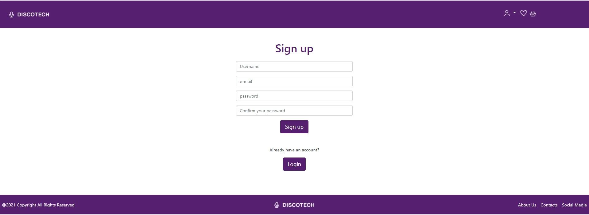
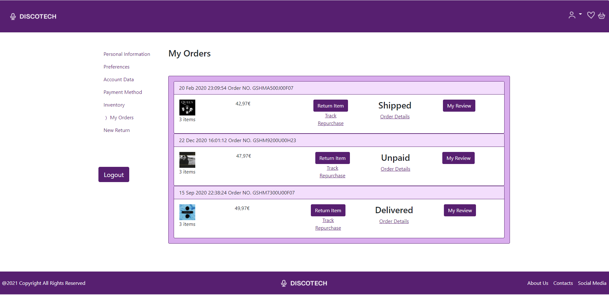
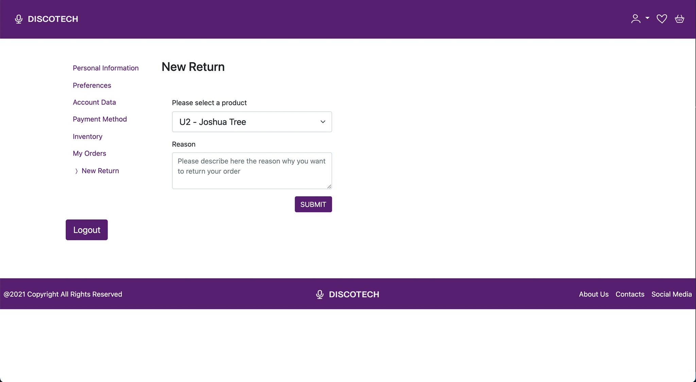

# ER: Requirements Specification Component

### Project vision

An Online Shop where you can increase your musical collection, buying discs and instruments, in an easy, accessible, safe and customizable way.

## A1: Online Shop
  
### Goals, business context and environment

Our goal is to develop a system based on a web interface, allowing the operation of an online shop selling discs and diverse music related items. The items are listed by the owner and should be available for purchase by the general public. 

### Motivation

Due to the exponencial growth of the online music industry, the amount of physical music related items has been decreasing significantly, favoring platforms like Youtube or Spotify. As such, the main goal of our online store is to contradict this trend, promoting a healthy and sustainable commerce, welcoming those that want to increase their physical collection.
 
### Main features and user profiles

In order to provide a good experience, the online store should be intuitive and simple, as well as favor the access to all the features when its mobile version is being used. 

The purchase of a product implies the creation of a new purchase process. This process should contain the following steps: selection of product(s), payment through one of the options, tracking of the delivery status and an eventual refund. 

For sorting purposes, the products must be organized by categories (instruments, vinyl, accessories...). It is possible to access a product through a text search by typing its name (entirely or partially), the artist/band, brand (according to the item in question), price, average rating (defined by the customers ratings for the product) and release date (for discs). 

There are two types of users: Registered users and Administrators. 

The registered users (clients) will have the oportunity to share their opinions on a specific item. This can be done through a comment as well as a rating on a pre-determined scale (0-5). Each user can choose their favorite artists and track all the items present in their collection (inventory), as well as those they can still acquire (wishlist). Each user will have a personal page, where they will be able to alter their preferences, informations and track their purchases. 
 

The store administrators will have access to several features allowing them to manage the store. They will be able to manage users, products and stock. User managing will allow admins to filter improper comments and delete accounts violating the store norms. The product and stock management allows them to manually change the quantity of each item (updated automatically after every purchase) as well as adding or removing them. These users have the possibility to manually accept payments done over bank transfer.  

Sign in and Sign up must be available at all times, in order to allow non-registered users to create and modify an account and letting them to access all of the websites features. 

---

## A2: Actors e User Stories

This document behaves as a definition of all the characteristics of the online shop that sells discs and musical instruments, allowing it to support its implementation afterwards.

### 1. Actors

*Picture 1: User Diagram*

| Identifier | Description | Example |
|---|---|---|
| User | Common usser with access to the catalog with all the available products. | n/a |
| Visitor | Not registered user that can create an account or login if it has already one. | n/a |
| Client | Registered user that can buy and rate products and also manage his own profile and preferences. | tiagoboldt |
| Administrator |  Special users with access to website administration features. | admin |

### 2. User Stories

#### 2.1. User

| Identifier | Name | Priority | Description |
|---|---|---|---|
| USU01 | Catalog | High | As an User, I want to navigate in the catalog of products so that I can see all the available products to buy. |
| USU02 | Category search | High | As an User, I want to search the products by category so that I can visualize all the ones that share some kind of type (discs, musical instruments, etc.) |
| USU03 | Advanced search | High | As an User, I want to search for products using a set of predefined filters so that I can visualize all the ones that have those qualities. |
| USU04 | Shop basket | High | As an User, I want to add new products to my shop basket so that I can buy them later on. |
| USU03 | Logout | High | As an User, I want to end my session so that I can protect it and, eventually, login in another one. |

#### 2.2. Visitor

| Identifier | Name | Priority | Description |
|---|---|---|---|
| USV01 | Login | High | As a Visitor, I want to login in the online shop so that I can have access to all the features a Client has. |
| USV02 | Signup | High | As a Visitor, I want to register myself so that I have a new account able to let me login. |

#### 2.3. Client

| Identifier | Name | Priority | Description |
|---|---|---|---|
| USC01 | Buy a product | High | As a Client, I want to buy the products I have in the shop basket so that I can increase my musical collection. |
| USC02 | Follow an order | High | As a Client, I want to follow an order so that I know when it will arrive. |
| USC03 | Account management | High | As a Client, I want to visualize, edit or delete my profile, mainly the e-mail and password I use to login so that I can keep my information updated. |
| USC04 | Rate a product | Medium | As a Client, I want to rate one or more products that I already bought so that I can contribute to the rate average of that product, available to all users. |
| USC05 | Purchases history | Medium | As a Client, I want all the products I buy to be automatically added to a purchase history so that I can see all my purchases in just one place. |
| USC06 | Wishlist | Low | As a Client, I want to add any product to any wishlist created by me so that I can have a list of products I wish to buy in the near future. |
| USC07 | Inventory | Low | As a Client, I want to add any product I already have (bought or not at the online shop) to an inventory created by me so that I can have a list of my products. |
| USC08 | Preferences | Low | As a Client, I want to choose my preferences, namely my favourite brands and artists, so that I can be recommended at the homepage to buy new products that match those preferences. |
| USC09 | Automatic payment | Low | As a Client, I want to pay one or more products through an automatic payment gateway so that I can receive my order faster and without the need to wait for the manual payment confirmation. |

#### 2.4. Administrator

| Identifier | Name | Priority | Description |
|---|---|---|---|
| USA01 | Manage products | High | As an Administrator, I want to see, add, remove or update the products of my online shop so that I can keep it updated. |
| USA02 | Manage users | High | As an Administrator, I want to alert or remove an user that doesn't follow the rules of the online shop so that I can keep the good environment and purpose of it. |
| USA03 | Manage ratings | Medium | As an Administrator, I want to manage all the comments made for some product so that I can avoid to have in my online shop messages that do not respect the others. |
| USA04 | Manual payments | Medium | As an Administrator, I want to manually validate all the payments made by money transfer so that I can send the waiting orders to their clients. |

### 3. Supplementary Requirements

This annex includes the business rules, the technical requirements and the restrictions.

#### 3.1. Business rules

A business rule defines or restricts an aspect of the business with the intention of clarify the business structure or its behaviour.

| Identifier | Name | Description |
|---|---|---|
| BR01 | User ratings | An User should be registered to be able to rate a product. |
| BR02 | Stock | The stock of a product should be verified and shown every time the respective page is visited. |
| BR03 | Average rating | The average rating of a product should be an average of all the submitted ratings by each user (on a scale of 0 to 5). |
| BR04 | Administrators | The administrators should have all the permissions to be able to manage all the products. |
| BR05 | Arriving date | The arriving date of an order should be later than its aquisition. |
| BR06 | Return date | The return of an order should be later than its arriving. |
| BR07 | Deleted user | Everytime an account is deleted by an administrator, all the data and information of that account should be deleted too, including ratings and comments. |
| BR08 | Logout | The logout should only be allowed when an user is logged in. | 

#### 3.2. Technical requirements

The technical requirements are the group of technical aspects the system should follow, as well as all the performance, reliability and responsibility issues.

| Identifier | Name | Description |
|---|---|---|
| TR01 | Availability | The online shop should be available 24 hours a day, 7 days a week. |
| TR02 | Acessibility | The online shop should be accessible to any user, independently of any physical or mental incapacity or limitation and regardless of the browser or device used. |
| TR03 | Usability | The online shop should be simple and easy to use. |
| TR04 | Performance | The online shop should have minimum response times to keep user's attention. |
| TR05 | Web App | The online shop should be implemented as a web app with dynamic webpages and using the following technologies: HTML, JavaScript, CSS and Bootstrap. |
| TR06 | Portability | The online shop server should be functionaly independent of the operating system used (Linux, Mac OS, Windows, Android, iOS). |
| TR07 | Database | The PostgreSQL database system should be used. |
| TR08 | Security | The online shop should protect the information from non-authorized access by using authentication mechanisms and a verification system. |
| TR09 | Robustness | The online shop should keep its normal behaviour ever when runtime errors occur. |
| TR10 | Scalability | The online shop should be prepared to deal with an increase of the number of users and the use they make. |
| TR11 | Ethics | The online shop should respect the ethical principles of software development like password and payments encryption and the identity of the administrators. |

#### 3.3. Restrictions

A restriction on the design limits the level of freedom in the search for a solution. 

| Identifier | Name | Description |
|---|---|---|
| R01 | Deadline | The online shop and its features should be functional by the end of this semester. |  

---

## A3: User Interface Prototype

This user interfaces prototype is intended to help to identify and describe the user requirements, give an overview of what's expected from the user interface of the online shop and to see the evolution through a set of iterations of the user interface design.

This artefact includes an overview of the interface elements and the main features (the ones shared by almost all the pages), an overview of the information architecture as seen by the users (sitemap) and the
identification and description of the main interactions with the system, shown as sequences of screens (wireflows).

By the end of this artifact, there's a section with the interface's descriptions.

### 1. Interface and common features

DiscoTech is an online shop built using HTML, PHP, JavaScript and CSS. The user interface was implemented using the Bootstrap framework.

|   |  | 
|:---:|:---:|
| Desktop | Mobile |

*Picture 2: Website Common Elements*

1. Logo
2. Navigation menu
3. Search bar
4. Content
4. Footer

This figure presents some characteristics common to all the pages like the header with the logo, the navigation menu and the search bar, the content of the page and the footer. All this elements mantain their position in all pages so that the user can quickly adapt to the website navigation.

We used a simple layout approach to allow the user to navigate easily through our online shop. We also made sure that our pages are intuitive enough to allow all the users to access all the features available.

### 2. Sitemap

The following picture shows our sitemap. It's possible to see the relationships between all the pages in our online shop and the group where each one fits in. By doing so, we make sure that later on will be easier to build our website considering all the hierarchy between pages.

*Picture 3: Sitemap*

### 3. Wireflows

*Picture 4: InVision Overview*

<em>Note: Due to the file size limit, we couldn't upload an overview with better quality</em>

The following pictures highlight the main use cases of our system. 

In the first one, we can see the difference between the Homepage without a logged in user and, after the successful login, the Homepage with the suggestions. Then, the user goes to the New Return screen to submit a return of a product.

*Picture 5: First Wireflow*

In the second one, considering the login done, the user goes to the catalog, then visits a product page and add that product to the basket (and repeat the last two steps two more times). Then, confirms the purchase by going to the basket and, finally, can see the order status in the Track Order screen.

*Picture 6: Second Wireflow*

In the third one, considering the user is not logged in, the user goes first to the product page and tries to add a review, but we can't do that as he's not logged in, so is asked to login before he can do so. Then, after a successful login, the user can comment the product and view all the reviews.

*Picture 7: Third Wireflow*

In the fourth and last one, the user this time has an admin account and, after a successful login, deletes an user and changes from Manage Users to Manual Payments screen to see those payments that require his attention.

*Picture 8: Fourth Wireflow*

Our InVision project is available at [InVision - lbaw2126](https://projects.invisionapp.com/freehand/document/DuUGaGPna? "InVision - lbaw2126")

### 4. Interfaces

In this section, each page is presented with a screenshot and a link to access it.

Our Online Shop has the following pages:

- Homepage (with different views according to the session status - logged in or not)
- About Us
- Page Not Found
- Shopping Basket (side menu)
- Login
- Signup
- My Profile (with multiple tabs)
- Catalog
- Single Product
- Add Review
- Checkout
- Track order
- Administration (with multiple tabs)

#### UI00: Homepage

|   |  | 
|:---:|:---:|
| Desktop | Mobile |

*Picture 9: Homepage w/ Login made* :earth_africa: [Homepage w/ Login](http://lbaw2126-piu.lbaw-prod.fe.up.pt/homepage-login.php "Homepage w/ Login")

|   |  | 
|:---:|:---:|
| Desktop | Mobile |

*Picture 10: Homepage w/o Login made* :earth_africa: [Homepage w/o Login](http://lbaw2126-piu.lbaw-prod.fe.up.pt/homepage-login.php "Homepage w/o Login")

#### UI01: About Us

|   |  | 
|:---:|:---:|
| Desktop | Mobile |

*Picture 11: About Us* :earth_africa: [About Us](http://lbaw2126-piu.lbaw-prod.fe.up.pt/aboutus.php "About Us")

#### UI02: Page not found

|   |  | 
|:---:|:---:|
| Desktop | Mobile |

*Picture 12: Error* :earth_africa: [Error](http://lbaw2126-piu.lbaw-prod.fe.up.pt/error.php "Error")

#### UI03: Shopping Basket

|   |  | 
|:---:|:---:|
| Desktop | Mobile |

*Picture 13: Shopping Basket* :earth_africa: [Shopping Basket](http://lbaw2126-piu.lbaw-prod.fe.up.pt/index.php "Shopping Basket")

#### UI04: Login

|   |  | 
|:---:|:---:|
| Desktop | Mobile |

*Picture 14: Login* :earth_africa: [Login](http://lbaw2126-piu.lbaw-prod.fe.up.pt/login.php "Login")

#### UI05: Signup

|   |  | 
|:---:|:---:|
| Desktop | Mobile |

*Picture 15: Signup* :earth_africa: [Signup](http://lbaw2126-piu.lbaw-prod.fe.up.pt/signup.php "Signup")

#### UI06: My Profile

|   |  | 
|:---:|:---:|
| Desktop | Mobile |

*Picture 16: My Profile* :earth_africa: [My Profile](http://lbaw2126-piu.lbaw-prod.fe.up.pt/myprofile.php "My Profile")

|   |  | 
|:---:|:---:|
| Desktop | Mobile |

*Picture 17: Preferences* :earth_africa: [Preferences](http://lbaw2126-piu.lbaw-prod.fe.up.pt/preferences.php "Preferences")

|   |  | 
|:---:|:---:|
| Desktop | Mobile |

*Picture 18: Account Data* :earth_africa: [Account Data](http://lbaw2126-piu.lbaw-prod.fe.up.pt/account_data.php "Account Data")

|   |  | 
|:---:|:---:|
| Desktop | Mobile |

*Picture 19: Payment Method* :earth_africa: [Payment Method](http://lbaw2126-piu.lbaw-prod.fe.up.pt/myprofile_payment_method.php "Payment Method")

|   |  | 
|:---:|:---:|
| Desktop | Mobile |

*Picture 20: Inventory* :earth_africa: [Inventory](http://lbaw2126-piu.lbaw-prod.fe.up.pt/myprofile_inventory.php "Inventory")

|   |  | 
|:---:|:---:|
| Desktop | Mobile |

*Picture 21: My Orders* :earth_africa: [My Orders](http://lbaw2126-piu.lbaw-prod.fe.up.pt/myorders.php "My Orders")

|   |  | 
|:---:|:---:|
| Desktop | Mobile |

*Picture 22: New Return* :earth_africa: [New Return](http://lbaw2126-piu.lbaw-prod.fe.up.pt/myprofile_new_return.php "New Return")

#### UI07: Catalog

|   |  | 
|:---:|:---:|
| Desktop | Mobile |

*Picture 23: Catalog* :earth_africa: [Catalog](http://lbaw2126-piu.lbaw-prod.fe.up.pt/catalog.php "Catalog")

#### UI08: Product

|   |  | 
|:---:|:---:|
| Desktop | Mobile |

*Picture 24: Product* :earth_africa: [Product](http://lbaw2126-piu.lbaw-prod.fe.up.pt/product.php "Product")

#### UI09: Add Review

|   |  | 
|:---:|:---:|
| Desktop | Mobile |

*Picture 25: Add Review* :earth_africa: [Add Review](http://lbaw2126-piu.lbaw-prod.fe.up.pt/reviews.php "Add Review")

#### UI10: Checkout

|   |  | 
|:---:|:---:|
| Desktop | Mobile |

*Picture 25: Checkout* :earth_africa: [Checkout](http://lbaw2126-piu.lbaw-prod.fe.up.pt/checkout.php "Checkout")

#### UI11: Track Order

|   |  | 
|:---:|:---:|
| Desktop | Mobile |

*Picture 26: Track Order* :earth_africa: [Track Order](http://lbaw2126-piu.lbaw-prod.fe.up.pt/track-order.php "Track Order")

#### UI12: Admin

|   |  | 
|:---:|:---:|
| Desktop | Mobile |

*Picture 27: Administration - Manage Products* :earth_africa: [Admin Manage Products](http://lbaw2126-piu.lbaw-prod.fe.up.pt/admin_manage_products.php "Admin Manage Products")

|   |  | 
|:---:|:---:|
| Desktop | Mobile |

*Picture 28: Administration - Manage Ratings* :earth_africa: [Admin Manage Ratings](http://lbaw2126-piu.lbaw-prod.fe.up.pt/admin_manage_ratings.php "Admin Manage Ratings")

|   |  | 
|:---:|:---:|
| Desktop | Mobile |

*Picture 29: Administration - Manage Users* :earth_africa: [Admin Manage Users](http://lbaw2126-piu.lbaw-prod.fe.up.pt/admin_manage_users.php "Admin Manage Users")

|   |  | 
|:---:|:---:|
| Desktop | Mobile |

*Picture 30: Administration - Manual Payments* :earth_africa: [Admin Manual Payments](http://lbaw2126-piu.lbaw-prod.fe.up.pt/admin_manual_payments.php "Admin Manual Payments")